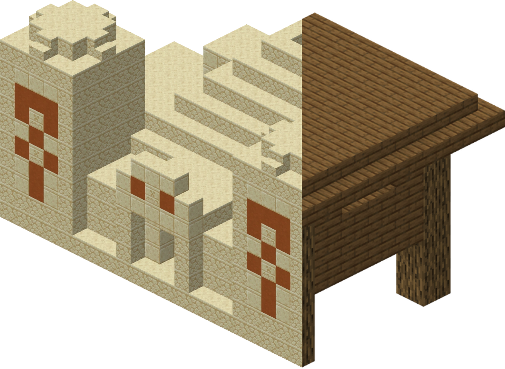
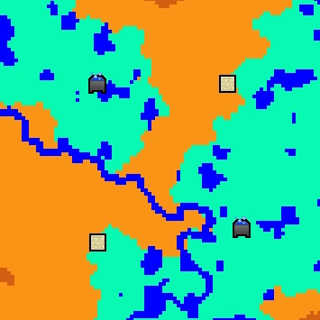
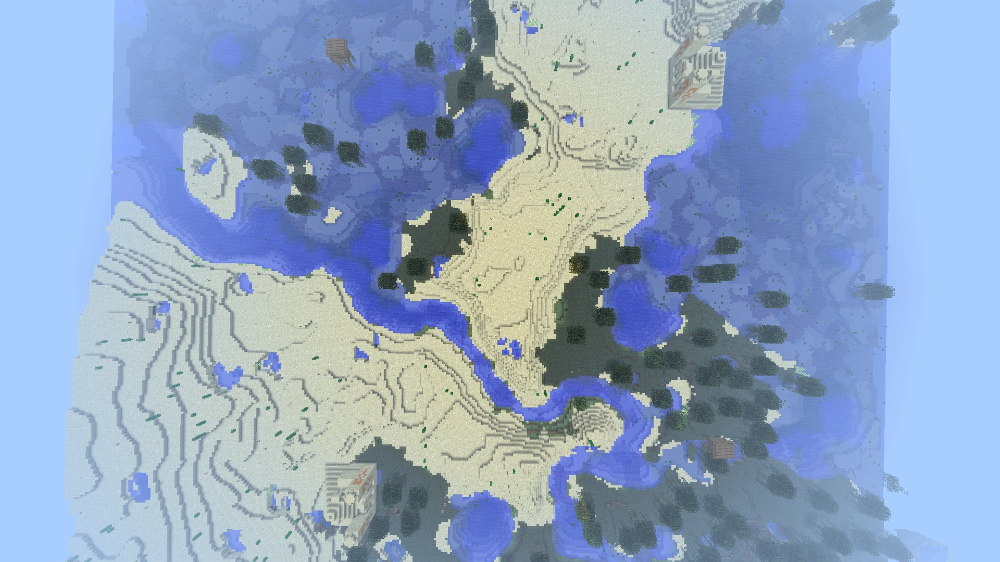
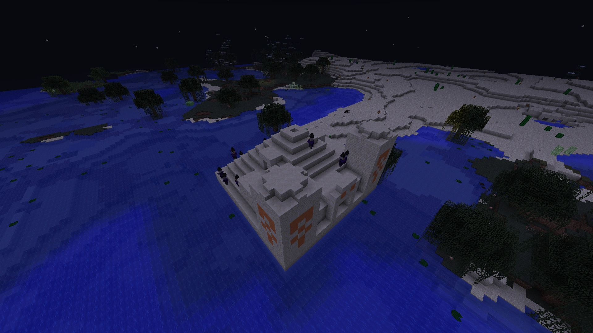
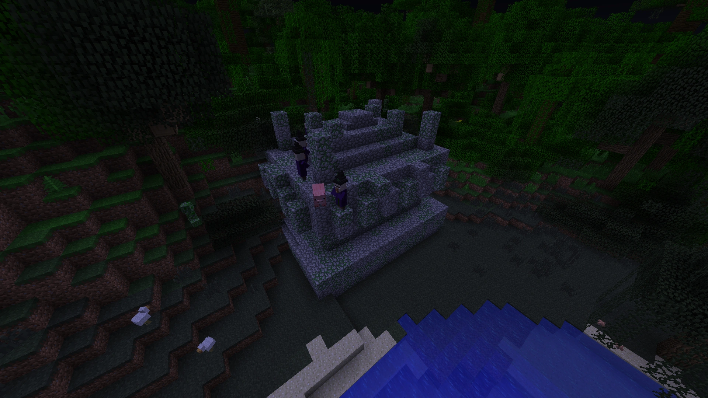
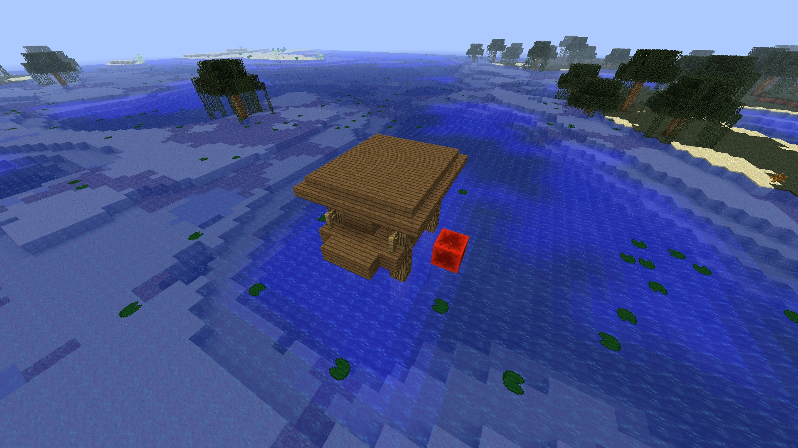

<div align="center">
  
  <h1>[WIP] Witch temple finder</h1>
</div>

## C++ console application to search for Minecraft Java Edition 1.4.2 - 1.6.2 seeds with Temples partially in swamp biomes

[](https://github.com/KK-mp4/witch-temple-finder/blob/master/README.md)
[](https://github.com/KK-mp4/witch-temple-finder/blob/master/README.ru.md)
[](https://deepwiki.com/KK-mp4/witch-temple-finder)

## Introduction

If you've played this game back when Witch mobs were added in 1.4.2 (12w38a) you maybe vaguely remember people reporting that witches spawn in Desert Pyramids or Jungle Temples. Well now I decided to investigate what was actually happening.

> [!NOTE]
> Contributions to this repository are welcome. More about how to contribute on the [development guide](https://github.com/KK-mp4/witch-temple-finder?tab=contributing-ov-file) page.

## Problem Statement

After decompiling and deobfuscating source code with [feather](https://github.com/OrnitheMC/feather) I found the root cause of this bug. Here is the summary:

1. Minecraft tried to place a "temple" structure in certain locations. Locations are randomly scattered around but deterministic for a given seed.

2. When game chooses a location is checks biome in the center of selected chunk (only one block) and chooses the structure type based on that:
    - `DesertPyramid` if the biome is `Biome.DESERT, Biome.DESERT_HILLS`
    - `JungleTemple` if the biome is `Biome.JUNGLE, Biome.JUNGLE_HILLS`
    - `WitchHut` if the biome is `Biome.SWAMPLAND`

3. No matter what type of temple was chosen, their bounding boxes get all assigned with witch spawning:

    ```java
    // Pseudocode
    public TempleStructure() {
        this.spawnEntries.add(new Biome.SpawnEntry(
            type: WitchEntity,
            weight: 1,
            minGroupSize: 1,
            maxGroupSize: 1
        ));
    }
    ```

4. Next, during hostile mob spawning if spawn attempt happen to land within a bounding box of the temple it does the following check:

    ```java
    // Pseudocode
    public List getSpawnEntries(MobCategory category, int x, int y, int z) {
        Biome biome = world.getBiome(x, z);

        if (biome == null) {
            return null;
        }

        if (biome == Biome.SWAMPLAND && category == MobCategory.MONSTER && temple.isInside(x, y, z)) {
            return temple.getSpawnEntries();
        }
    ```

5. The smartest of you probably figured out an issue here. Type of temple gets decided on a single block, yet spawning does not care about the type of the temple, it only cares that the spawning is happening inside of temple and in swamp biome. This means that it doesn't matter what type of temple got generated, all it's blocks that are located within swamp biome will spawn witches just like witch huts doo. Some more trivia:

```cpp
// width, height, depth
static const PieceSize DESERT_PYRAMID = {21, 15, 21};
static const PieceSize JUNGLE_TEMPLE = {12, 10, 15};
static const PieceSize WITCH_HUT = {7, 5, 9};
```

And while in [Minecraft JE 1.8.1](https://minecraft.wiki/w/Java_Edition_1.8.1) bounding box size of witch huts was actually increased by two blocks `{7, 7, 9}` allowing to build a farm with 3 floors, this is still not even close to jungle and desert pyramid sizes. So this is when my quest started, a quest to find seeds where instead of quad witch huts I search for desert pyramids that are mostly inside swamps.

## A quest to find seeds

My starting point was figuring out how game determines which biome it is at a given block. Thankfully I did not have to worry about implementing noise map fun myself, since I found [cubiomes](https://github.com/Cubitect/cubiomes) - C library that mimics the Minecraft biome generation. And supports old Minecraft JE versions!

Now all I had to do is to replicate logic that game uses to select chunks for temple generation. Thankfully that was just a couple of lines of code. From now on algorithm is simple:

*Check center of the chunk biome to get temple type* -> *given it's type get it's bounding box size* -> *compute how many blocks are inside swamp*

Thanks to [Bjoel](https://github.com/TheBjoel2) for [C++ Java random implementation](https://github.com/TheBjoel2/Slime-Chunk-Finder/blob/master/JavaRandom.cpp).

And thats basically it! Some optimizations and multithreading later - results are down below.

> [!TIP]
> For previewing old Minecraft seeds I recommend using [Amidst](https://github.com/toolbox4minecraft/amidst), [Cubiomes Viewer](https://github.com/Cubitect/cubiomes-viewer) or [Minemap](https://github.com/hube12/Minemap).

## Results

Those seeds should work in every Minecraft JE version in range 1.4.2 - 1.6.2. In 1.6.4 it was silently fixed. The seed finder needs further optimizations, I only ran for ~100k seeds in single temple category and only scanned `65536x65536` area around `0, 0`. As for multi-temples there must be a rewrite for sure to make it work.

### Best found multi-temples (similar to quad witch search)

<table>
  <thead>
    <tr>
      <th>Seed</th>
      <th>Structure type</th>
      <th>X</th>
      <th>Z</th>
      <th>Witch spawn blocks</th>
      <th>Total witch spawn blocks</th>
      <th>% of max <code>(21 * 21 - 1) * 5 * 4</code></th>
    </tr>
  </thead>
  <tbody>
    <tr>
      <td rowspan="4">423630031342907782</td>
      <td>WitchHut</td>
      <td>-144</td>
      <td>-160</td>
      <td>126</td>
      <td rowspan="4">2492</td>
      <td rowspan="4">28.32%</td>
    </tr>
    <tr>
      <td>DesertPyramid</td>
      <td>-144</td>
      <td>16</td>
      <td>1580</td>
    </tr>
    <tr>
      <td>DesertPyramid</td>
      <td>0</td>
      <td>-160</td>
      <td>660</td>
    </tr>
    <tr>
      <td>WitchHut</td>
      <td>16</td>
      <td>0</td>
      <td>126</td>
    </tr>
    <tr>
      <td rowspan="4">3242038509290238342</td>
      <td>WitchHut</td>
      <td>-144</td>
      <td>-160</td>
      <td>126</td>
      <td rowspan="4">2492</td>
      <td rowspan="4">28.32%</td>
    </tr>
    <tr>
      <td>DesertPyramid</td>
      <td>-144</td>
      <td>16</td>
      <td>1580</td>
    </tr>
    <tr>
      <td>DesertPyramid</td>
      <td>0</td>
      <td>-160</td>
      <td>660</td>
    </tr>
    <tr>
      <td>WitchHut</td>
      <td>16</td>
      <td>0</td>
      <td>126</td>
    </tr>
    <tr>
      <td rowspan="4">-576737481905294970</td>
      <td>WitchHut</td>
      <td>-144</td>
      <td>-160</td>
      <td>126</td>
      <td rowspan="4">1958</td>
      <td rowspan="4">22.25%</td>
    </tr>
    <tr>
      <td>DesertPyramid</td>
      <td>-144</td>
      <td>16</td>
      <td>1580</td>
    </tr>
    <tr>
      <td>WitchHut</td>
      <td>0</td>
      <td>-160</td>
      <td>126</td>
    </tr>
    <tr>
      <td>WitchHut</td>
      <td>16</td>
      <td>0</td>
      <td>126</td>
    </tr>
  </tbody>
</table>

<p align="center">
  
</p>

<p align="center">
  
</p>

### Best found single temple

| Seed | Structure type | X | Z | Swamp blocks | % of max `21 * 21 - 1` | Spawning spaces
|-|-|-|-|-|-|-
| 28257 | DesertPyramid | 22784 | 16752 | 401 | 91.14% | 2005
| 42162 | DesertPyramid | 49264 | -21248 | 393 | 89.32% | 1965
| 38711 | DesertPyramid | -29984 | -16752 | 381 | 86.59% | 1905
| 1306145184061456995 | DesertPyramid | -25976656 | -29555600 | 378 | 85.91% | 1890
| 38513 | DesertPyramid | 46144 | 21616 | 375 | 85.23% | 1875

<p align="center">
  
</p>

### Best found jungle temples (single temple search)

Note: this list may contain false positives, because of [issue#1](https://github.com/KK-mp4/witch-temple-finder/issues/1).

| Seed | Structure type | X | Z | Swamp blocks | % of max `12 * 15 - 1` | Spawning spaces
|-|-|-|-|-|-|-
| 65631 | JungleTemple | -41200 | 21104 | 173 | 96.65% | 692
| 6156 | JungleTemple | -26608 | 9904 | 167 | 93.30% | 668
| 167 | JungleTemple | -56976 | -61376 | 167 | 93.30% | 668
| 3818 | JungleTemple | 7968 | 28016 | 165 | 92.18% | 660
| 62650 | JungleTemple | 65136 | -26256 | 165 | 92.18% | 660
| 1214 | JungleTemple | 21280 | 30304 | 164 | 91.62% | 656
| 2687 | JungleTemple | 23568 | -50608 | 164 | 91.62% | 656
| 2534 | JungleTemple | -14000 | -23232 | 163 | 91.06% | 652
| 3450 | JungleTemple | -24736 | 10832 | 163 | 91.06% | 652
| 62564 | JungleTemple | 53408 | 31792 | 163 | 91.06% | 652
| 470 | JungleTemple | -28496 | 30864 | 162 | 90.50% | 648
| 2516 | JungleTemple | -20688 | 8464 | 161 | 89.94% | 644
| 418 | JungleTemple | 8224 | 33312 | 161 | 89.94% | 644
| 135 | JungleTemple | 11328 | -34672 | 160 | 89.38% | 640

<p align="center">
  
</p>

### Worst witch hut

Since game checks center of the chunk to determine type of temple and witch hut doesn't extend far enough to cover that center piece, it is actually possible to find a witch hut that is fully outside of swamp, so I took a small side quest to find such witch hut.

| Seed | Structure type | X | Z | Swamp blocks | % of max `0` | Spawning spaces
|-|-|-|-|-|-|-
| 903 | WitchHut | -65536 | 22384 | 0 | 100% | 0

The redstone block on this image shows location that was actually checked to determine type of temple and it is inside of swamp biome. Witch hut on the other hand is actually fully in river biome.

<p align="center">
  
</p>

### Sister seeds

Minecraft actually uses only lower 48 bits of the seed for structure generation and full 64 bits for biomes. This means It is actually more effective to first find lower 48 bits where you get quad temple and later search through remaining sister seeds. I did not implement this logic yet, so [contributions](https://github.com/KK-mp4/witch-temple-finder?tab=contributing-ov-file) are welcome.

```math
\text{"base seeds":}\quad 2^{48} = 281474976710656
```

```math
\text{"sister seeds":}\quad 2^{16} = 65536
```

Note that this is completely opposite of [shadow seeds](https://seedfinding.com/shadow_seed/) - when two seeds share same biome map but everything else is different.

> [!TIP]
> If you input seed 0 into seed field Minecraft would actually generate random one. To generate actual seed 0 world, as Panda explained his video "*[Seeds & Generation #01: Ways to Enter a Seed](https://youtu.be/OLS7CCgNcuY)*" you would need to enter something like `PDFYFCD` as suggested by [seedinfo](https://panda4994.github.io/seedinfo/seedinfo.html#0) tool.

If you want to learn more about seed finding I recommend [fnseedc](https://github.com/SeedFinding/fnseedc) repository.

## Farming possibilities

I am currently working on a couple of designs: "*[Desert Pyramid Witch Farm and Extended Shifting Floor | Minecraft ~1.4.2 - 1.6.2](https://youtu.be/Fetwu5-A980?list=PLI-RNUGw-AeSV09QsBt6lBs1ORZgm889b)*":

- Clock-based
- Detection based with extended shifting floor
- Path finding-based

If you forgot how witch farming looked like in those days I also compiled a playlist "*[Witch Farm Tech](https://youtube.com/playlist?list=PLI-RNUGw-AeR6QwW321UA8VxnCXdqrv18&si=n7UHa07ntY9rAeuC)*".

## Setup with [VSCode](https://code.visualstudio.com/)

If you are using other IDE, you probably know that you are doing and able to compile C++ code yourself. Down below I will provide a simple setup.

This project includes the [`.vscode/extensions.json`](https://github.com/KK-mp4/witch-temple-finder/blob/main/.vscode/extensions.json) file, meaning that when you open project it will prompt you with "*Do you want to install recommended extensions?*" notification. Click yes.

Now click "*Left Control + Shift + P*" to open quick actions tab and search for "*CMake: Configure*". Then scan for kits and if there is none you would have to install some C++ compiler. After that is done you can compile this project for your system and run it.

To run different finders you can use *Run and Debug* tab on the left panel, there in the dropdown you can select different launch options. To modify launch options you can edit [`.vscode/launch.json`](https://github.com/KK-mp4/witch-temple-finder/blob/main/.vscode/launch.json) file.

## Contributors

<a href="https://github.com/KK-mp4/witch-temple-finder/graphs/contributors">
  
</a>

## [License](https://github.com/KK-mp4/witch-temple-finder/blob/master/LICENSE.md)

This program is licensed under the MIT License. Please read the License file to know about the usage terms and conditions.
